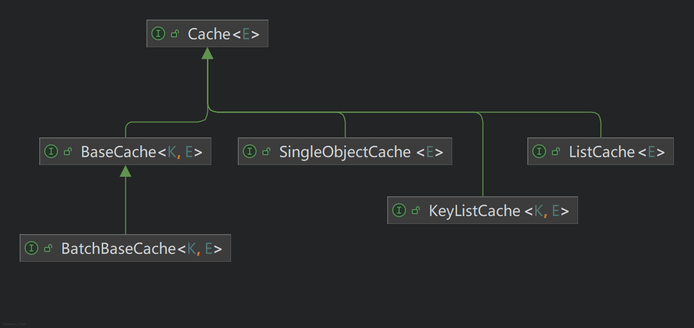

# Cache Basics - 数据缓存基础

## 综述

数据缓存接口用于在持久化存储之外缓存实体数据，从而减少数据库访问、提高读取性能。
在本项目中，数据缓存通常以分布式缓存（例如 Redis）为后端，使多个进程或实例能够共享同一份缓存数据。

推荐为读取量较大、写入量较小的实体配置缓存；具体是否启用、超时时间等需结合业务一致性与运维策略权衡。

本项目中的数据缓存机制与“本地缓存处理器”（`LocalCacheHandler`）不同：前者面向“跨进程共享”的典型场景，后者面向“进程内内存”缓存。
二者的定位差异与选型建议见 [Local Cache Basics](./LocalCacheBasics.md) 中的“与数据缓存接口的区别”一节。

更宏观的数据访问概念（实体、Dao、Service 等）见 [Data Access Basics](./DataAccessBasics.md)。

## 接口定义

所有的数据缓存接口均位于 `com.dwarfeng.subgrade.stack.cache` 包中。
除根接口外，具体缓存接口均以实体类型 `E extends Entity<?>` 为操作对象；带主键的接口使用 `K extends Key` 作为键类型。

根接口 `Cache` 的 UML 关系与常用子接口的概览见：

### 根接口 `Cache`

`com.dwarfeng.subgrade.stack.cache.Cache` 是所有数据缓存接口的根，定义如下行为：

- `clear()`：清空该缓存对象所管理的全部内容，可能抛出 `CacheException`。

因此，在类型层次上它仍体现“数据缓存”的契约；除 `clear` 外，具体读写语义由子接口定义。

### `BaseCache`

`BaseCache<K extends Key, E extends Entity<K>>` 提供按主键访问的单实体缓存：

| 方法                             | 说明                            |
|:-------------------------------|:------------------------------|
| `exists(K key)`                | 判断指定主键是否存在于缓存中。               |
| `get(K key)`                   | 获取指定主键对应的实体。                  |
| `push(E entity, long timeout)` | 写入或更新缓存；`timeout` 为毫秒，表示过期时间。 |
| `delete(K key)`                | 删除指定主键对应的缓存项。                 |
| `clear()`                      | 继承自 `Cache`，清空本缓存管理的全部键值。     |

### `BatchBaseCache`

`BatchBaseCache` 在 `BaseCache` 基础上增加批量操作：

| 方法                                          | 说明                                                  |
|:--------------------------------------------|:----------------------------------------------------|
| `allExists(List<K> keys)`                   | 当且仅当列表中**每一个**主键在缓存中均存在时返回 `true`。                  |
| `nonExists(List<K> keys)`                   | 当且仅当列表中**每一个**主键在缓存中均不存在时返回 `true`。                 |
| `batchGet(List<K> keys)`                    | 按顺序批量获取与主键列表对应的实体列表。                                |
| `batchPush(List<E> entities, long timeout)` | 批量写入；实现上对每个实体执行与 `push` 等价的写入，`timeout` 为毫秒，表示过期时间。 |
| `batchDelete(List<K> keys)`                 | 批量删除指定主键。                                           |

### `ListCache`

`ListCache<E extends Entity<?>>` 表示“固定逻辑键”下的一组实体列表（实现上通常对应 Redis 中的单个列表键），提供：

- 存在性：`exists()`；
- 规模：`size()`；
- 读取：全量 `get()`，以及按起止下标或 `PagingInfo` 分页读取的重载；
- 写入：`set(Collection<E> entities, long timeout)` 覆盖整个列表；`leftPush` / `rightPush` 在列表两端追加元素。

### `KeyListCache`

`KeyListCache<K extends Key, E extends Entity<? extends Key>>` 表示**按业务主键 `K` 分桶**的列表缓存：每个 `K` 对应一条列表，
语义与 `ListCache` 类似，但所有方法均带 `K key` 参数，并提供 `delete(K key)` 删除某键下的整段列表。

适用于“某父实体 / 维度下挂子项列表”且需在缓存中按主键隔离的场景。

### `SingleObjectCache`

`SingleObjectCache<E extends Entity<?>>` 表示全局仅缓存一个实体实例（无业务主键维度的多键）：

| 方法                            | 说明                    |
|:------------------------------|:----------------------|
| `exists()`                    | 判断该单对象是否存在于缓存中。       |
| `get()`                       | 获取缓存的实体。              |
| `put(E entity, long timeout)` | 写入或更新；`timeout` 为毫秒。  |
| `clear()`                     | 继承自 `Cache`，清空该单对象缓存。 |

常与 `SingleObjectDao`、`SingleObjectService` 及 `GeneralSingleObjectService` 配合使用。

## 默认实现

### Redis 实现

`com.dwarfeng.subgrade.impl.cache` 包提供了基于 Spring Data Redis 的实现，包括：

| 类名                       | 对应的接口               |
|:-------------------------|:--------------------|
| `RedisBaseCache`         | `BaseCache`         |
| `RedisBatchBaseCache`    | `BatchBaseCache`    |
| `RedisListCache`         | `ListCache`         |
| `RedisKeyListCache`      | `KeyListCache`      |
| `RedisSingleObjectCache` | `SingleObjectCache` |

这些类通过 `RedisTemplate<String, JE>` 访问 Redis，使用 `StringKeyFormatter<K>` 将业务主键格式化为 Redis 的字符串键，
使用 `BeanTransformer<E, JE>` 在领域实体与存储用的 Bean 之间转换。

`push`、`set` 等写入方法中的超时时间与接口约定一致，单位为毫秒，由实现转换为 Redis 的过期时间。

`clear()` 在 `RedisBaseCache`、`RedisBatchBaseCache` 等实现中通常通过 `StringKeyFormatter` 的 `generalFormat()`
得到键模式，扫描匹配键后批量删除。
因此键空间设计需与该格式化策略一致，避免误删其它业务数据。

实现类 Javadoc 说明：类本身不声明事务；若需要事务边界，应在代理类或外层封装中处理。

### Null 实现（禁用缓存）

自 1.7.1 起，提供 `NullBaseCache`、`NullBatchBaseCache`、`NullListCache`、`NullKeyListCache`、`NullSingleObjectCache`
等 Null（空对象）实现：
在 Spring 配置中将原 Redis 缓存 Bean 替换为对应 Null 实现，可在不修改业务代码的前提下关闭缓存副作用。
典型行为：`exists` 恒为 `false`；`get` 抛出 `CacheException`；写入与删除多为空操作。

## 与服务层的典型协作

### `GeneralCrudService` 与 `BaseCache`

`GeneralCrudService` 组合 `BaseDao` 与 `BaseCache`，读取路径大致为：

1. 若 `cache.exists(key)` 为真，则直接 `cache.get(key)` 返回；
2. 否则访问 `dao`；若数据不存在则按服务约定抛出业务异常；
3. 若从数据库读出实体，则调用 `cache.push(entity, cacheTimeout)` 回填缓存，其中 `cacheTimeout` 由构造参数注入，单位为毫秒。

服务还提供 `dumpCache(key)`：优先从缓存或数据库取得实体后再次 `push`，用于手动刷新缓存。

### `GeneralBatchCrudService` 与 `BatchBaseCache`

`GeneralBatchCrudService` 使用 `BatchBaseCache`，单键读写逻辑与上述类似；另提供 `batchDumpCache(List<K> keys)`，
对多个主键依次执行与 `dumpCache` 等价的回填逻辑。

### `GeneralSingleObjectService` 与 `SingleObjectCache`

`GeneralSingleObjectService` 组合 `SingleObjectDao` 与 `SingleObjectCache`：

- `get()`：若 `cache.exists()`，则 `cache.get()`；否则 `dao.get()` 后 `cache.put(entity, cacheTimeout)`；
- `put(entity)`：先写入 `dao`，再 `cache.put`；
- `clear()`：同时清空 `dao` 与 `cache`（具体语义以实现为准）。

## 异常

缓存层方法抛出 `com.dwarfeng.subgrade.stack.exception.CacheException`（通常为包装底层存储或序列化异常）。
对外服务接口则多使用 `ServiceException`，
并通过异常映射统一处理；详见 [Exception Mapping Basics](./ExceptionMappingBasics.md)。

## 相关文档

- [Data Access Basics](./DataAccessBasics.md) — 实体、Dao、数据缓存与服务接口总览。
- [Local Cache Basics](./LocalCacheBasics.md) — 本地缓存处理器及与数据缓存接口的对比。
- [Exception Mapping Basics](./ExceptionMappingBasics.md) — 服务异常与映射机制。
