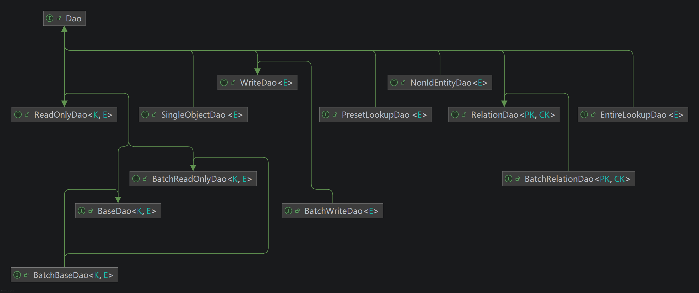

# Dao Basics - 数据访问层（Dao）基础

## 综述

数据访问层（Dao）封装对持久化数据的读写与查询，是服务层与具体存储技术之间的边界。
在本项目中，Dao 以接口形式定义在 `com.dwarfeng.subgrade.stack.dao` 包中，由 `subgrade-impl` 模块提供多种实现，
便于按项目技术栈组合选用。

实体与主键的建模约定（`Entity`、`Key`、联合主键等）以及 Dao、缓存、服务接口在整体中的位置，
见 [Data Access Basics](./DataAccessBasics.md)；
缓存的接口语义与 `GeneralCrudService` 等组合缓存时的读路径，见 [Cache Basics](./CacheBasics.md)。

本文在“接口定义”中说明各 Dao 接口的方法契约；在“默认实现”中按技术栈列出主要实现类；在“与服务层的典型协作”中说明与通用服务实现的组合方式。

## 接口定义

所有的 Dao 接口均位于 `com.dwarfeng.subgrade.stack.dao` 包中。

根接口与各子接口的 UML 关系见：

### 根接口 `Dao`

`com.dwarfeng.subgrade.stack.dao.Dao` 是所有数据访问层接口的根，本身不声明方法，作为标记接口表示“属于数据访问层”的类型归属。

### `ReadOnlyDao`

`ReadOnlyDao<K extends Key, E extends Entity<K>>` 提供按主键的只读访问：

| 方法              | 说明              |
|:----------------|:----------------|
| `exists(K key)` | 判断指定主键对应实体是否存在。 |
| `get(K key)`    | 获取指定主键对应的实体。    |

### `BatchReadOnlyDao`

`BatchReadOnlyDao<K extends Key, E extends Entity<K>>` 继承 `ReadOnlyDao`，提供批量只读语义：

| 方法                        | 说明                          |
|:--------------------------|:----------------------------|
| `allExists(List<K> keys)` | 当且仅当列表每一个主键均存在时返回 `true`。   |
| `nonExists(List<K> keys)` | 当且仅当列表中每一个主键均不存在时返回 `true`。 |
| `batchGet(List<K> keys)`  | 按顺序批量获取与主键列表对应的实体列表。        |

### `BaseDao`

`BaseDao<K extends Key, E extends Entity<K>>` 继承 `ReadOnlyDao`，在只读能力之上增加增删改：

| 方法                  | 说明           |
|:--------------------|:-------------|
| `insert(E element)` | 插入实体，返回对应主键。 |
| `update(E element)` | 更新实体。        |
| `delete(K key)`     | 按主键删除。       |

一对多关系可在两侧各用 `BaseDao` 维护实体，多对多关系见 `RelationDao`。

### `BatchBaseDao`

`BatchBaseDao<K extends Key, E extends Entity<K>>` 继承 `BaseDao` 与 `BatchReadOnlyDao`，
在单条 CRUD 与批量只读之外增加批量写入与批量删除：

| 方法                              | 说明           |
|:--------------------------------|:-------------|
| `batchInsert(List<E> elements)` | 批量插入，返回主键列表。 |
| `batchUpdate(List<E> elements)` | 批量更新。        |
| `batchDelete(List<K> keys)`     | 批量删除。        |

### `RelationDao`

`RelationDao<PK extends Key, CK extends Key>` 面向多对多：维护父项主键 `PK` 与子项主键 `CK` 之间的多对多关联。

| 方法                             | 说明             |
|:-------------------------------|:---------------|
| `existsRelation(PK pk, CK ck)` | 判断父项与子项是否存在关联。 |
| `addRelation(PK pk, CK ck)`    | 增加一条关联。        |
| `deleteRelation(PK pk, CK ck)` | 删除一条关联。        |

### `BatchRelationDao`

`BatchRelationDao<PK extends Key, CK extends Key>` 继承 `RelationDao`，
在单条关联操作之外增加针对子项主键列表的批量语义（另继承上表中的 `existsRelation`、`addRelation`、`deleteRelation`）。

| 方法                                          | 说明                                     |
|:--------------------------------------------|:---------------------------------------|
| `existsAllRelations(PK pk, List<CK> cks)`   | 当且仅当每一个指定的子项主键都与 `pk` 存在关联时返回 `true`。  |
| `existsNonRelations(PK pk, List<CK> cks)`   | 当且仅当每一个指定的子项主键都与 `pk` 不存在关联时返回 `true`。 |
| `batchAddRelations(PK pk, List<CK> cks)`    | 为父项批量添加与子项的关联。                         |
| `batchDeleteRelations(PK pk, List<CK> cks)` | 批量删除父项与多个子项的关联。                        |

### `EntireLookupDao`

`EntireLookupDao<E extends Entity<?>>` 适用于数据量可控、需要“查全表”或按分页遍历的场景：

| 方法                              | 说明                                  |
|:--------------------------------|:------------------------------------|
| `lookup()`                      | 返回全部元素列表。                           |
| `lookup(PagingInfo pagingInfo)` | 分页查询。                               |
| `lookupCount()`                 | 元素总数。                               |
| `lookupFirst()`                 | 默认方法：取第一页一条，无数据时返回 `null`（自 1.2.8）。 |

### `PresetLookupDao`

`PresetLookupDao<E extends Entity<?>>` 支持有限个命名预设（`preset`）及参数数组（`objs`），用于条件查询与统计：

| 方法                                                            | 说明                                |
|:--------------------------------------------------------------|:----------------------------------|
| `lookup(String preset, Object[] objs)`                        | 满足预设的全部结果。                        |
| `lookup(String preset, Object[] objs, PagingInfo pagingInfo)` | 分页结果。                             |
| `lookupCount(String preset, Object[] objs)`                   | 满足预设的数量。                          |
| `lookupFirst(String preset, Object[] objs)`                   | 默认方法：取第一条，无数据时返回 `null`（自 1.2.8）。 |

### `WriteDao`

`WriteDao<E extends Entity<?>>` 面向大量追加写入（如数据采集）场景，与 `WriteService` 配套。

| 方法                 | 说明                                                    |
|:-------------------|:------------------------------------------------------|
| `write(E element)` | 写入一条实体。主键允许为 `null`；若主键非 `null`，则必须保证该主键对应数据在写入前尚不存在。 |

### `BatchWriteDao`

`BatchWriteDao<E extends Entity<?>>` 继承 `WriteDao`，在单条 `write` 之外增加批量写入（另继承上表中的 `write`）。

| 方法                             | 说明                                |
|:-------------------------------|:----------------------------------|
| `batchWrite(List<E> elements)` | 批量写入；语义上对每个元素执行与 `write` 等价的写入约束。 |

### `SingleObjectDao`

`SingleObjectDao<E extends Entity<?>>` 表示全局仅一条的实体，常用于配置项、全局开关等与主键集合无关的持久化单例数据。

| 方法              | 说明           |
|:----------------|:-------------|
| `exists()`      | 判断该单对象是否已存在。 |
| `get()`         | 获取当前存储的实体。   |
| `put(E entity)` | 插入或更新为指定实体。  |
| `clear()`       | 删除该单对象对应的数据。 |

### `NonIdEntityDao`

`NonIdEntityDao<E>` 继承 `Dao`，本身不声明方法，用于与“无主键实体”相关的数据访问类型标记；具体方法由项目侧扩展约定。

## 默认实现

`com.dwarfeng.subgrade.impl.dao` 包提供各技术栈下的实现类。 同类实现的方法语义与接口一致，差异主要体现在底层 API。

实现类通常不声明事务边界，需要在代理类或外层封装中统一加事务，与缓存、服务层文档中的说明一致。

### Hibernate 实现

基于 Spring `HibernateTemplate` 与实体/持久化 Bean 的 `BeanTransformer` 等组件。

| 类名                                       | 实现的接口                  |
|:-----------------------------------------|:-----------------------|
| `HibernateBaseDao`                       | `BaseDao`              |
| `HibernateBatchBaseDao`                  | `BatchBaseDao`         |
| `HibernateRelationDao`                   | `RelationDao`          |
| `HibernateBatchRelationDao`              | `BatchRelationDao`     |
| `HibernateEntireLookupDao`               | `EntireLookupDao`      |
| `HibernatePresetLookupDao`               | `PresetLookupDao`      |
| `HibernateHqlPresetLookupDao`            | `PresetLookupDao`      |
| `HibernateAccelerablePresetLookupDao`    | `PresetLookupDao`      |
| `HibernateAccelerableHqlPresetLookupDao` | `PresetLookupDao`      |
| `HibernateAcceleratePresetLookupDao`     | `PresetLookupDao`（已废弃） |
| `HibernateWriteDao`                      | `WriteDao`             |
| `HibernateBatchWriteDao`                 | `BatchWriteDao`        |
| `HibernateSingleObjectDao`               | `SingleObjectDao`      |

此外提供 `HibernateDaoFactory`：
根据方言、`PresetCriteriaMaker`、本地 SQL 查询等参数构造合适的 `PresetLookupDao` 实现（如 Criteria 与可加速原生查询等变体），
用于在运行时选择 Hibernate 侧预设查询策略。

### JDBC 实现

基于 Spring `JdbcTemplate` 等，适合显式 SQL 与轻量依赖场景。

| 类名                    | 实现的接口             |
|:----------------------|:------------------|
| `JdbcBaseDao`         | `BaseDao`         |
| `JdbcBatchBaseDao`    | `BatchBaseDao`    |
| `JdbcEntireLookupDao` | `EntireLookupDao` |
| `JdbcPresetLookupDao` | `PresetLookupDao` |
| `JdbcWriteDao`        | `WriteDao`        |
| `JdbcBatchWriteDao`   | `BatchWriteDao`   |

### MyBatis 实现

基于 MyBatis `SqlSession` 与映射语句 id，与 Mapper XML / 注解配合使用。

| 类名                        | 实现的接口              |
|:--------------------------|:-------------------|
| `MybatisBaseDao`          | `BaseDao`          |
| `MybatisBatchBaseDao`     | `BatchBaseDao`     |
| `MybatisRelationDao`      | `RelationDao`      |
| `MybatisBatchRelationDao` | `BatchRelationDao` |
| `MybatisEntireLookupDao`  | `EntireLookupDao`  |
| `MybatisPresetLookupDao`  | `PresetLookupDao`  |
| `MybatisWriteDao`         | `WriteDao`         |
| `MybatisBatchWriteDao`    | `BatchWriteDao`    |

### Memory 实现

进程内 Map 等结构，多用于测试或轻量场景。

| 类名                      | 实现的接口             |
|:------------------------|:------------------|
| `MemoryBaseDao`         | `BaseDao`         |
| `MemoryBatchBaseDao`    | `BatchBaseDao`    |
| `MemoryEntireLookupDao` | `EntireLookupDao` |
| `MemoryPresetLookupDao` | `PresetLookupDao` |
| `MemorySingleObjectDao` | `SingleObjectDao` |

### Redis 实现

基于 `RedisTemplate<String, JE>`，通过 `StringKeyFormatter<K>` 格式化键、`BeanTransformer` 在领域实体与存储 Bean 间转换，
适用于以 Redis 为存储后端的实体。

| 类名                     | 实现的接口             |
|:-----------------------|:------------------|
| `RedisBaseDao`         | `BaseDao`         |
| `RedisBatchBaseDao`    | `BatchBaseDao`    |
| `RedisEntireLookupDao` | `EntireLookupDao` |
| `RedisPresetLookupDao` | `PresetLookupDao` |
| `RedisSingleObjectDao` | `SingleObjectDao` |

## 与服务层的典型协作

下列通用实现位于 `com.dwarfeng.subgrade.impl.service` 包。
类本身多不声明事务，需在代理层增加事务； 对外异常通常为 `ServiceException`，经异常映射统一处理（见“异常”一节）。
与缓存组合的读路径细节见 [Cache Basics](./CacheBasics.md)。

### `GeneralCrudService` 与 `BaseDao`

`GeneralCrudService` 组合 `BaseDao` 与 `BaseCache`：
存在性优先查缓存，未命中再访问 `dao`；`get` 从数据库读出后会 `push` 回填缓存；
`insert`/`update`/`delete` 在操作数据库后同步维护缓存；并提供 `dumpCache(key)` 手动刷新缓存。

### `GeneralBatchCrudService` 与 `BatchBaseDao`

`GeneralBatchCrudService` 组合 `BatchBaseDao` 与 `BatchBaseCache`，批量语义与单键场景类似，
并提供 `batchDumpCache` 等多键回填能力。

### `DaoOnlyCrudService` / `DaoOnlyBatchCrudService`

`DaoOnlyCrudService` 仅依赖 `BaseDao`，`DaoOnlyBatchCrudService` 仅依赖 `BatchBaseDao`，不使用缓存，
适合不需要缓存或自行组合装饰的场景。

### `GeneralEntireLookupService` 与 `EntireLookupDao`

`GeneralEntireLookupService` 组合 `EntireLookupDao` 与 `ListCache`：
若列表缓存存在则优先走缓存，否则调用 `dao.lookup()` 后写入列表缓存，再对外提供分页等查询。

### `DaoOnlyEntireLookupService`

仅依赖 `EntireLookupDao`，不经过列表缓存。

### `DaoOnlyPresetLookupService` 与 `PresetLookupDao`

`DaoOnlyPresetLookupService` 将预设查询委托给 `PresetLookupDao`，不内置与 `ListCache` 的固定组合；若需缓存，可在业务侧自行包装。

### `DaoOnlyRelationService` / `DaoOnlyBatchRelationService`

分别组合 `RelationDao` 与 `BatchRelationDao`，提供关系维度的服务封装。

### `DaoOnlyWriteService` / `DaoOnlyBatchWriteService`

分别组合 `WriteDao` 与 `BatchWriteDao`，适用于采集等写入场景。

### `GeneralSingleObjectService` 与 `SingleObjectDao`

`GeneralSingleObjectService` 组合 `SingleObjectDao` 与 `SingleObjectCache`：
`get` 优先缓存，否则读 Dao 后回填；`put` 先写 Dao 再写缓存；`clear` 同时清理 Dao 与缓存（具体以实现为准）。

### `DaoOnlySingleObjectService`

仅依赖 `SingleObjectDao`，不使用单对象缓存。

## 异常

数据访问层方法抛出 `com.dwarfeng.subgrade.stack.exception.DaoException`（通常为包装底层存储或映射异常）。
对外服务接口多使用 `ServiceException`，并通过异常映射统一处理；
详见 [Exception Mapping Basics](./ExceptionMappingBasics.md)。

## 参阅

- [Data Access Basics](./DataAccessBasics.md) — 实体、主键、Dao、缓存与服务接口总览。
- [Cache Basics](./CacheBasics.md) — 数据缓存接口及与服务层的典型协作。
- [Exception Mapping Basics](./ExceptionMappingBasics.md) — 服务异常与映射机制。
