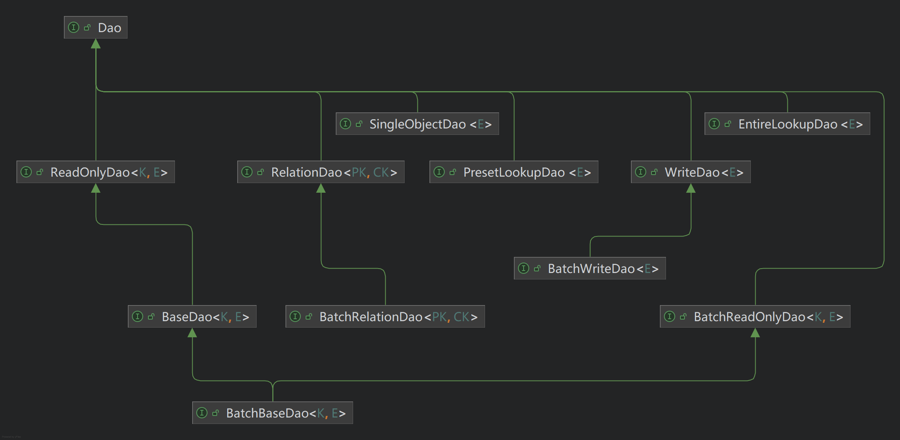
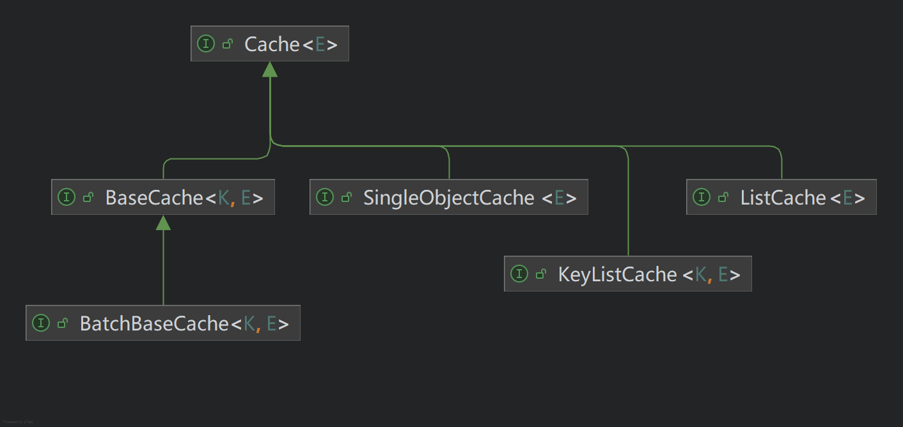
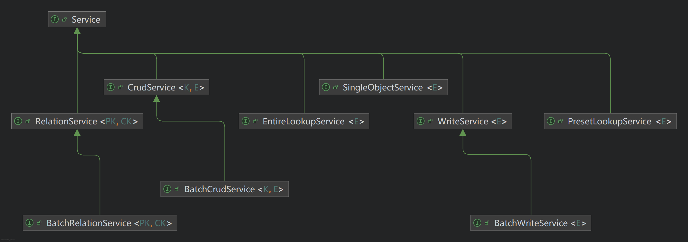

# Data Access Basics - 数据访问基础

## 综述

数据访问功能是几乎每个后台服务都需要的基础功能，它提供了对数据的访问、处理和存储等功能。
本项目的数据访问机制旨在提供一个灵活、可扩展的框架，以便于开发者能够快速实现各种数据访问需求。

## 接口定义

### 主键与实体接口

在本项目中，所有的实体必须统一实现 `com.dwarfeng.subgrade.stack.bean.entity.Entity` 接口，本接口签名如下：

```java
public interface Entity<K extends Key> extends Bean {

    /**
     * 获取主键。
     *
     * @return 实体的主键。
     */
    K getKey();

    /**
     * 设置实体的主键。
     *
     * @param key 被设置的主键。
     */
    void setKey(K key);

}
```

该接口定义了一个实体的主键获取和设置方法，后续的数据访问操作都将基于这些基础方法进行。

其中，`K` 是主键的类型，必须实现 `com.dwarfeng.subgrade.stack.bean.key.Key` 接口。

`Key` 接口是一个标记接口，表示该类型是一个主键类型。它的定义如下：

```java
public interface Key extends Bean {
}
```

对于 `Key` 接口，请遵循以下原则：

1. 所有的主键类型都必须实现 `Key` 接口。
2. 实现 `Key` 接口时，务必重写 `equals()` 和 `hashCode()` 方法，以确保主键的唯一性和可比较性。

与一部分常见的数据访问工具处理方式不同，在本项目中，所有的主键都被当做联合主键处理，即使只有一个字段，也会被认为是联合主键。
这个特性可以极大地为联合主键提供支持。

所有的主键类型都必须实现 `Key` 接口，并且所有的主键都被当做联合主键处理，意味着即使是一些简单的主键类型，
如 `Long`、`String` 等，也需要实现 `Key` 接口，这可能会增加一些开发的复杂度，因此，本项目提供了一些常用的主键类型，
见下表：

本项目中所有的内置主键均在 `com.dwarfeng.subgrade.stack.bean.key` 包中定义。

| 主键类名           | 描述                                          |
|:---------------|:--------------------------------------------|
| `ByteIdKey`    | 基于 `Byte` 的主键类型，适合只有一个 `byte` 字段作为主键的场景     |
| `DenseUuidKey` | 基于 `String` 的主键类型，适合只有一个紧凑 UUID 字段作为主键的场景   |
| `IntegerIdKey` | 基于 `Integer` 的主键类型，适合只有一个 `int` 字段作为主键的场景   |
| `LongIdKey`    | 基于 `Long` 的主键类型，适合只有一个 `long` 字段作为主键的场景     |
| `StringIdKey`  | 基于 `String` 的主键类型，适合只有一个 `String` 字段作为主键的场景 |
| `UuidKey`      | 基于 `UUID` 的主键类型，适合只有一个 `UUID` 字段作为主键的场景     |

### 数据访问层接口

数据访问层接口是本项目中用于访问数据的核心接口，它定义了对数据的基本操作，如增删改查等。

所有的数据访问层接口都必须继承自 `com.dwarfeng.subgrade.stack.dao.Dao` 接口，该接口本身是一个标记接口，
表示该接口是一个数据访问层接口。

`Dao` 接口的 UML 图如下：



下表中列出常用的数据访问层接口：

| 接口名                | 描述                               |
|:-------------------|:---------------------------------|
| `BaseDao`          | 基础数据访问层接口，提供了对数据的基本操作方法，如增、删、改。  |
| `BatchBaseDao`     | 在 `BaseDao` 的基础上，提供了批量操作的方法。     |
| `RelationDao`      | 提供了多对多关系的操作方法。                   |
| `BatchRelationDao` | 在 `RelationDao` 的基础上，提供了批量操作的方法。 |
| `EntireLookupDao`  | 提供了对整体数据的查询方法，适用于数据量较小的实体。       |
| `PresetLookuDao`   | 提供了基于预设查询条件的查询方法，适用于数据量较大的实体。    |
| `WriteDao`         | 对数据的写入操作进行了优化，适用于大量数据的写入场景。      |
| `BatchWriteDao`    | 在 `WriteDao` 的基础上，提供了批量写入的方法。    |

### 数据缓存接口

数据缓存接口是本项目中用于缓存数据的接口。

使用缓存，可以提高数据访问的性能，减少对数据库的访问压力。推荐为所有读取量较大、写入量较小的实体配置缓存。

所有的缓存都必须继承自 `com.dwarfeng.subgrade.stack.cache.Cache` 接口，该接口本身是一个标记接口，
表示该接口是一个数据缓存接口。

`Cache` 接口的 UML 图如下：



下表中列出常用的数据缓存接口：

| 接口名              | 描述                                        |
|:-----------------|:------------------------------------------|
| `BaseCache`      | 基础数据缓存接口，提供了对数据的基本缓存操作方法，如存在性检查、获取、推送、删除。 |
| `BatchBaseCache` | 在 `BaseCache` 的基础上，提供了批量操作的方法。            |
| `ListCache`      | 针对一个实体列表进行缓存的缓存接口。                        |
| `KeyListCache`   | 针对一个实体列表进行缓存的缓存接口，使用主键作为索引。               |

### 服务接口

无论是数据访问层接口还是数据缓存接口，都是在项目内部使用的接口。

按照本项目的核心思想，所有对外暴露的服务都应该实现 `com.dwarfeng.subgrade.stack.service.Service` 接口，
数据访问机制也不例外。

与数据访问有关的 `Service` 接口的 UML 图如下：



下表中列出常用的数据访问服务接口：

| 接口名                    | 描述                                   |
|:-----------------------|:-------------------------------------|
| `CrudService`          | 基础的增删改查服务接口，提供了对数据的基本操作方法，如增、删、改。    |
| `BatchCrudService`     | 在 `CrudService` 的基础上，提供了批量操作的方法。     |
| `RelationService`      | 提供了多对多关系的操作方法。                       |
| `BatchRelationService` | 在 `RelationService` 的基础上，提供了批量操作的方法。 |
| `EntireLookupService`  | 提供了对整体数据的查询方法，适用于数据量较小的实体。           |
| `PresetLookupService`  | 提供了基于预设查询条件的查询方法，适用于数据量较大的实体。        |
| `WriteService`         | 对数据的写入操作进行了优化，适用于大量数据的写入场景。          |
| `BatchWriteService`    | 在 `WriteService` 的基础上，提供了批量写入的方法。    |

## 默认实现

本项目提供了上述接口的大量默认实现，开发者可以直接使用这些实现来满足大部分的数据访问需求。

### 数据访问层的默认实现

- `Hibernate` 实现。
- `JDBC` 实现。
- `Memory` 实现。
- `Mybatis` 实现。
- `Redis` 实现。

### 数据缓存的默认实现

- `Redis` 实现。

### 服务的默认实现

- 通用实现。
- 仅数据访问层实现。
- 自定义实现。
